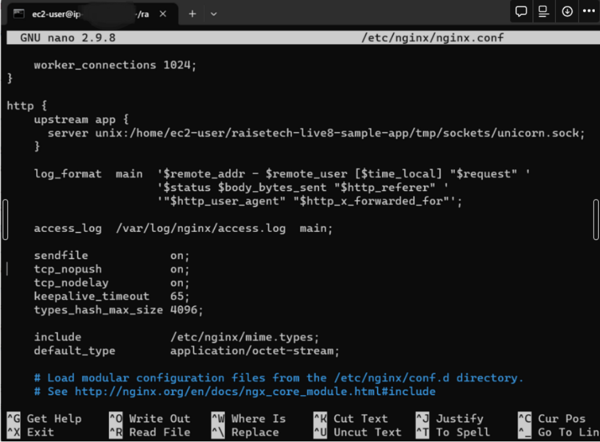

# UnicornとNginxを利用するときによく使うコマンド
・unicornを起動(development)　```bundle exec unicorn -c /home/ec2-user/raisetech-live8-sample-app/config/unicorn.rb -E development -D```

・unicornを停止(マスタープロセスのPIDは以下の場合は15406)　```kill -9 [マスタープロセスのPID]```


・unicornが起動しているかの確認(上記のようなmasterやworkerが表示されない場合はunicornサーバーが停止している)　```ps aux | grep unicorn```

・単一のファイルを削除　```rm unicorn.log```

・unicornのログファイルの中身を表示　```cat unicorn.log```

・Nginxの起動　```sudo systemctl start nginx```

・Nginxが起動しているかの確認　```sudo systemctl status nginx```

・Nginxの停止　```sudo systemctl stop nginx```

・Nginxのエラーログやアクセスログのファイルがあるか確認　```sudo ls /var/log/nginx/```

・error.logまたはaccess.logの中身を見る　```sudo cat /var/log/nginx/error.log```

・error.logまたはaccess.logの削除　```sudo rm /var/log/nginx/error.log```

・error.logまたはaccess.logの作成　```sudo touch /var/log/nginx/error.log```

・後半の20行だけログを表示　```sudo tail -n 20 unicorn.log```

・gemファイルの変更を反映　```bundle install```

・特定のファイルやディレクトリを検索する　`find / -name "ファイル名またはディレクトリ名"`

・ブラウザからEC2上のアプリにアクセスするにはEC2のパブリックIPv4 アドレスをブラウザに入力

・ブラウザからALBを経由してEC2上のアプリにアクセスするにはALBのDNS名をブラウザに入力

# EC2上のNginxとUnicornにアプリをデプロイしてALB経由でS3に画像をアップロード
【手動構築の手順(IAMロール)】
1. `sudo yum install git -y`
2. `git clone [リポジトリのURL]`
3. `sudo yum update -y`
4. `sudo yum install -y curl gpg gcc gcc-c++ make`
5. `curl -sSL https://rvm.io/mpapis.asc | gpg2 --import -`
6. `curl -sSL https://rvm.io/pkuczynski.asc | gpg2 --import -`
7. `gpg2 --keyserver hkp://keyserver.ubuntu.com --recv-keys 409B6B1796C275462A1703113804BB82D39DC0E3 7D2BAF1CF37B13E2069D6956105BD0E739499BDB`
8. `curl -sSL https://get.rvm.io | bash -s stable`
9. `echo 'source ~/.rvm/scripts/rvm' >> ~/.bashrc`
10. `source ~/.rvm/scripts/rvm && rvm list | grep 'ruby-[rubyのバージョン]'`
11. `source ~/.rvm/scripts/rvm && rvm install ruby-[rubyのバージョン]`
12. `source ~/.rvm/scripts/rvm && gem install bundler -v [bundlerのバージョン]`
13. `sudo yum install mysql-devel -y`
14. `cd [プロジェクトディレクトリ名]`
15. `bundle install`
16. `sudo yum install python3-pip -y`
17. `sudo pip3 install PyMySQL`
18. `sudo yum install mysql -y`
19. `mysql -h [RDSのエンドポイント] -u [RDSのマスターユーザー名(デフォルトはadmin)] -p[RDSのマスターパスワード] -e "CREATE DATABASE IF NOT EXISTS [任意のデータベーステーブル名];"`
20. `cd config`
21. `cp database.yml.sample database.yml`
22. `vi database.yml`
23. `username`の値をRDSのマスターユーザー名(デフォルトはadmin)に変更
24. `default`の`password`にRDSのマスターパスワードを追加
25. `development`と`test`の`database`の値を19で作成したデータベーステーブル名に変更
26. `host`キーと値であるRDSのエンドポイントを`development`と`test`に追加
27. `port`キーと値であるRDSのポート番号(デフォルトは3306)を`development`と`test`に追加
28. `development`と`test`の`socket`をコメントアウトにする。データの保存先がRDSなので`socket`をコメントアウトにしている。
29. ファイルを保存する
30. `cd ..`
31. `curl -o- https://raw.githubusercontent.com/nvm-sh/nvm/v[nvmのバージョン]/install.sh | bash`
32. `cd`
33. `echo 'export NVM_DIR="$HOME/.nvm"' >> /home/ec2-user/.bashrc`
34. `cd [プロジェクトディレクトリ名]`
35. `[ -s "$NVM_DIR/nvm.sh" ] && \. "$NVM_DIR/nvm.sh"`
36. `. ~/.nvm/nvm.sh`
37. `nvm install [Node.jsのバージョン]`
38. `cd`
39. `export PATH="/home/ec2-user/.nvm/versions/node/v[Node.jsのバージョン]/bin:$PATH"`
40. `npm install -g yarn`
41. `sudo yum install -y ImageMagick`
42. `cd [プロジェクトディレクトリ名]`
43. `sudo amazon-linux-extras install nginx1 -y`
44. `rvmsudo -u ec2-user bundle install`
45. `cd config`
46. `vi unicorn.rb`
47. worker_processesの次の行に追加　`working_directory "/home/ec2-user/[プロジェクトディレクトリ]"`
48. listenの最後に追加　`, :backlog => 64`
49. listenの次の行に追加　`listen 8080, :tcp_nopush => true`
50. pidの次の行に追加　`stdout_path "/home/ec2-user/アプリのプロジェクト名/unicorn.log"`
51. stdout_pathの次の行に追加　`stderr_path "/home/ec2-user/アプリのプロジェクト名/unicorn.log"`
52. ファイルを保存する
53. `sudo vi /etc/nginx/nginx.conf`
54. `user nginx;`を`user ec2-user;`に変更
55. 以下をhttpブロックに追加

```
upstream app {
        server unix:/home/ec2-user/アプリのプロジェクト名/unicorn.sock;
    }
```

56. serverブロックに以下を追加

```
        location / {
            proxy_set_header X-Forwarded-For $proxy_add_x_forwarded_for;
            proxy_set_header Host $http_host;
            proxy_redirect off;
            proxy_pass http://app;
        }

        location ^~ /assets/ {
            root /home/ec2-user/[プロジェクトディレクトリ]/public;
            gzip_static on;
            expires max;
            add_header Cache-Control public;
        }
```

57. ファイルを保存する
58. `vi environments/development.rb`
59. `config.active_storage.service = :local`を`config.active_storage.service = :amazon`に書き換える
60. `config.assets.debug = true`を以下に書き換える

```
  config.assets.debug = false
  config.assets.compile = true
```

61. ファイルを保存して閉じる
62. `cd ..`
63. `RAILS_ENV=development bundle exec rake assets:precompile`
64. `sudo su - ec2-user -c 'bin/rails db:migrate RAILS_ENV=development'`
65. `cd`
66. `sudo su - ec2-user -c 'cd /home/ec2-user/[プロジェクトディレクトリ] && bin/rails db:migrate RAILS_ENV=development'`
67. `cd /home/ec2-user/raisetech-live8-sample-app/config/storage.yml`
68. regionを対象のS3バケットがあるリージョン、bucketを対象のS3バケット名に変更する
69. NginxとUnicornを起動するとBlocked hostが表示される
70. `vi config/environments/development.rb`
71. ファイルの末尾にBlocked hostで表示された`config.hosts << "ALBのDNS名"`を記載する
72. NginxとUnicornを停止して起動する

【手動構築の手順(アクセスキー)】
`storage.yml`の`access_key_id`と`secret_access_key`をS3へのアクセスを許可したIAMユーザーのアクセスキーとシークレットアクセスキーに変更する。

# EC2上のNginxとUnicornにアプリをデプロイする手順(データベースはRDSを使用)
※インストールするパッケージのバージョンはREADME.mdに書かれている
1. gitパッケージをインストール　```sudo yum install git -y```
2. リポジトリをクローン　```git clone [リポジトリのURL]```
3. システム上のすべてのパッケージを最新のバージョンに更新　```sudo yum update -y```
4. ソフトウェアパッケージをLinuxシステムにインストール　```sudo yum install curl gpg gcc gcc-c++ make -y```
5. RVMの開発者の公開鍵を信頼できる鍵としてローカルのGPGキーリングに追加　```curl -sSL https://rvm.io/mpapis.asc | gpg2 --import -```
6. RVMのGPGキーをインポート　```curl -sSL https://rvm.io/pkuczynski.asc | gpg2 --import -```
7. RVMの安定版をインストール　```\curl -sSL https://get.rvm.io | bash -s stable```
8. RVMのスクリプトをシェルにロード　```source ~/.rvm/scripts/rvm```
9. システムが適切に準備されているかを確認　```rvm requirements```
10. Rubyをインストール　```rvm install ruby-3.1.2```
11. Bundlerをインストール　```gem install bundler:2.3.14```
12. mysql-develパッケージをインストール　```sudo yum install mysql-devel```
13. アプリのプロジェクトディレクトリに移動
14. gemをインストール　```bundle install```
15. サンプルファイルをコピー　```cp config/database.yml.sample config/database.yml```
16. MySQLのインストール `curl -fsSL https://raw.githubusercontent.com/MasatoshiMizumoto/raisetech_documents/main/aws/scripts/mysql_amazon_linux_2.sh | sh`
17. MySQLに接続　```mysql -h [RDSのエンドポイント] -P 3306 -u admin -p```
18. 新しいデータベースインスタンスを作成　```CREATE DATABASE [新しく作成するデータベース名];```
19. アプリのプロジェクトディレクトリ→configに移動
20. database.ymlを開く　```vi database.yml```
21. developmentとtestのdatabaseの値をさっき作成したデータベース名に変更
22. usernameの値をRDSのユーザー名(デフォルトはadmin)に変更
23. defaultのpasswordにRDSのパスワードを追加
24. hostキーと値であるRDSのエンドポイントをdevelopmentとtestに追加
25. portキーと値であるRDSのポート番号(デフォルトは3306)をdevelopmentとtestに追加
26. developmentとtestのsocketをコメントアウトにすることで適用されないようにする
27. viエディタを保存して閉じる
28. アプリのプロジェクトディレクトリに移動
29. nvmをインストール　`curl -o- https://raw.githubusercontent.com/nvm-sh/nvm/v0.39.5/install.sh > install_nvm.sh`を実行して後に`bash install_nvm.sh`を実行する。

    v0.39.5は最新を確認→https://github.com/nvm-sh/nvm
    
30. NVM_DIRを設定　```export NVM_DIR="$HOME/.nvm"```
31. nvmの初期化スクリプトが存在し、かつサイズが0でない場合に、そのスクリプトを実行　```[ -s "$NVM_DIR/nvm.sh" ] && \. "$NVM_DIR/nvm.sh"```
32. Node.jsをインストール　```nvm install 17.9.1```
33. yarnをインストール　```npm install -g yarn```
34. プロジェクトのセットアップと初期化　```bin/setup```
35. ImageMagickソフトウェアパッケージをインストール　```sudo yum install -y ImageMagick```
36. アプリケーションサーバーを起動　```bin/dev```
37. Nginxをインストール　```sudo amazon-linux-extras install nginx1 -y```
38. 依存関係を解決　```bundle install```
39. configディレクトリに移動
40. unicorn.rbファイルを開く　```vi unicorn.rb```
41. worker_processesの次の行に追加　```working_directory "/home/ec2-user/アプリのプロジェクト名"```
42. listenの最後に追加　```, :backlog => 64```
43. listenの次の行に追加　```listen 8080, :tcp_nopush => true```
44. pidの次の行に追加　```stdout_path "/home/ec2-user/アプリのプロジェクト名/unicorn.log"```
45. stdout_pathの次の行に追加　```stderr_path "/home/ec2-user/アプリのプロジェクト名/unicorn.log"```
46. vimエディタを保存して閉じる
47. nginx.confファイルを開く　```sudo vim /etc/nginx/nginx.conf```
48. httpブロックに追加
```
upstream app {
        server unix:/home/ec2-user/アプリのプロジェクト名/unicorn.sock;
    }
```



48. serverブロックに追加
```
        location / {
            proxy_set_header X-Forwarded-For $proxy_add_x_forwarded_for;
            proxy_set_header Host $http_host;
            proxy_redirect off;
            proxy_pass http://app;
         }
```


49. Nginxの設定をテスト　```sudo nginx -t```
50. EC2のセキュリティグループのインバウンドでHTTPを許可するルールを追加する。そして、RDSのセキュリティーグループのインバウンドでEC2からの通信のみを許可するルールを作成する。
51. unicorn.sockのパーミッションの所有者をnginxユーザーに変更　```sudo chown nginx:nginx /home/ec2-user/アプリのプロジェクト名/unicorn.sock```
52. パーミッションを変更　```chmod o+x /home/ec2-user```
53. Unicornと Nginxを起動する。
# EC2上のNginxとUnicornにアプリをデプロイしたものにALBを追加する手順
1. 上記の「EC2上のNginxとUnicornにアプリをデプロイする手順(データベースはRDSを使用)」を行う。
2. マネジメントコンソールのEC2の画面から左のサイドバーにある「ロードバランサー」→「ロードバランサーの作成」→をクリックして ALBを選択する。
3. 「基本的な設定」の項目では、「ロードバランサー名」に名前をつける。
4. 「ネットワークマッピング」の項目では、「VPC」にEC2があるVPCを選択、AZを二つ選択し、サブネットは⚠️のマークが表示されないサブネットを選択する。
5. 「セキュリティグループ」の項目では、ALB用に新しく作成する。
6. 「リスナーとルーティング」の項目では、「デフォルトアクション」の「ターゲットグループの作成」をクリックする。
7. 「基本的な設定」の項目では、「ターゲットグループ名」に名前をつけて、EC2が設置されているVPCを選択。
8. 一番下までスクロールして「次へ」をクリックする。
9. 「使用可能なインスタンス」の項目で対象のEC2にチェックをつけ、「選択したインスタンスのポート」で8080を入力し、「保留中として以下を含める」をクリックする。
10.  一番下までスクロールして「ターゲットグループの作成」をクリックする。
11.  ALBを作成しているページに戻って「デフォルトアクション」にさっき作成したターゲットグループを選択する。
12.  一番下までスクロールして「ロードバランサーの作成」をクリックする。
13.  UnicornとNginxを停止して、起動させる。
14.  ALBのDNS名をブラウザに入力してアクセスする。
15.  Blocked hostというエラーが発生するので、ブラウザのエラー文に表示されている```config.hosts << "ec2-34-239-115-7.compute-1.amazonaws.com"```をコピーしてconfig→environments→development.rbファイルの末尾に書き込む
16.  ファイルやディレクトリの所有者と権限を確認するために、unicorn.sockがあるディレクトリで```ls -l```を実行する。
17.  srwxrwxr-x 1 nginx nginx 0 Sep 19 12:41 unicorn.sockが表示されてUnicornをec2-userとして実行している場合、所有者と権限の変更をする必要があるのでunicorn.sockがあるディレクトリで```sudo chown ec2-user:ec2-user unicorn.sock```を実行する。
18.  ファイルの権限も適切に設定するために、unicorn.sockがあるディレクトリで```sudo chmod 600 unicorn.sock```を実行する。
19. UnicornとNginxを停止して、起動させる。

# ALBを追加したEC2にS3を追加して、RDSではなくS3をデータ保存先として変更する手順
1. マネジメントコンソールのS3の画面から「バケットを作成」をクリックする。
2. 「一般的な設定」の項目では、「バケット名」で名前をつけて、「AWS リージョン」でEC2が配置されているリージョンを選択する。EC2が配置されているリージョンはEC2のAZがus-east-1bとなっていた場合、us-east-1がリージョン名になる。
3. 一番下までスクロールして「バケットを作成」をクリックする。
4. マネジメントコンソールのIAMの画面から「ユーザーの作成」をクリックする。
5. 「ユーザー名」に名前をつけて「次へ」をクリックする。
6. 「許可のオプション」の項目では、「ポリシーを直接アタッチする」を選択して、「許可ポリシー」の検索欄に許可したいポリシーで検索してそれを選択する。
7. 一番下までスクロールして「次へ」をクリックして、また一番下までスクロールして「ユーザーの作成」をクリックする。
8. 作成したIAMユーザーの詳細ページに行き、「セキュリティ認証情報」→「アクセスキーを作成」をクリックする。
9. 「AWS コンピューティングサービスで実行されるアプリケーション」を選択して、一番下のチェックボックスにチェックを入れて、「次へ」をクリックする。
10. 「アクセスキーを作成」→「.csvファイルをダウンロード」をクリックする。ダウンロードされたファイルにはアクセスキーとシークレットアクセスキーの情報が書いてあるので大切に保管する必要がある。最後に「完了」をクリックする。
11. ターミナルでconfigディレクトリに移動する
12. storage.ymlを開く　```vi storage.yml```
13. S3の設定を変更する
```
amazon:
  service: S3
  access_key_id: <%= Rails.application.credentials.dig(:aws, :access_key_id) %>
  secret_access_key: <%= Rails.application.credentials.dig(:aws, :secret_access_key) %>
  region: us-east-1
  bucket: your_bucket_name_here
```
<%= Rails.application.credentials.dig(:aws, :access_key_id) %>をIAMユーザーのAccess key IDに変更

<%= Rails.application.credentials.dig(:aws, :secret_access_key) %>をIAMユーザーのSecret access keyに変更

us-east-1をS3バケットが配置されているリージョンに変更

your_bucket_name_hereをS3バケット名に変更

14. 依存関係のインストール　```bundle install --with development```
15. マイグレーション　```RAILS_ENV=development bundle exec rails db:migrate```
16. 作成したS3バケットの詳細ページに行き、「アクセス許可」をクリックする。下にスクロールするとCORSを編集できる項目があるので以下のコードを追加する。
```
[
    {
        "AllowedHeaders": [
            "*"
        ],
        "AllowedMethods": [
            "GET",
            "PUT",
            "POST",
            "DELETE",
            "HEAD"
        ],
        "AllowedOrigins": [
            "*"
        ],
        "ExposeHeaders": [],
        "MaxAgeSeconds": 3000
    }
]
```
17. UnicornとNginxを停止して、起動させる。
18. ALBのDNS名をブラウザに入力してアクセスする。
19. development.logの末尾に```[ActionDispatch::HostAuthorization::DefaultResponseApp] Blocked host: etl.colorblockplaaygame.com```といったエラーがあり、このエラーはホストをブロックしているというエラーなのでconfig/environments/development.rbに```config.hosts << "etl.colorblockplaaygame.com"```といったものを追加してあげる。
20. UnicornとNginxを停止して、起動させる。

# S3にオブジェクトが保存されているかEC2上から確認
1. AWS CLIの設定　```aws configure```
2. 以下の情報を入力します

AWS Access Key ID: IAMユーザーのアクセスキーID

AWS Secret Access Key: IAMユーザーのシークレットアクセスキー

Default region name: S3バケットのリージョン名（例：ap-northeast-1）

Default output format: json

3. S3バケット内のオブジェクトの確認　aws s3 ls s3://S3バケット名/

# S3のCORSについて
## CORSとは
S3バケットに対してWebサイトやWebアプリケーションからアクセスを許可するかのルールを設定する項目
## CORSのコード解説
```
[
    {
        "AllowedHeaders": [
            "*"
        ],
        "AllowedMethods": [
            "GET",
            "PUT",
            "POST",
            "DELETE",
            "HEAD"
        ],
        "AllowedOrigins": [
            "*"
        ],
        "ExposeHeaders": [],
        "MaxAgeSeconds": 3000
    }
]
```
### AllowedHeaders
リクエストが持っているどの情報に対して許可するかを設定する。
### *(アスタリスク)
すべてを許可することを意味する。
### AllowedMethods
リクエストのどの行動を許可するかを設定する。
### PUT
更新
### POST
作成
### HEAD
ヘッダーの情報
### AllowedOrigins
どのWebサイトやWebアプリケーションからのアクセスを許可するかを設定する。
### ExposeHeaders
ブラウザから見ることができるヘッダーの情報を指定する。
### []
[]の中に何もない場合は何も設定や指定をしていないことを意味する。
### MaxAgeSeconds
ブラウザがS3から提供してもらった情報を覚えていられる時間を設定する。設定した時間が過ぎたらブラウザは再度S3に対してデータを共有しても良いのかをS3に尋ねる必要がある。
### 3000
3000秒のこと。
# RDSのセキュリティグループを変更
AWSのマネジメントコンソールからセキュリティグループを変更したいRDSの詳細情報が書かれているページに行き、右上の「変更」をクリックしてそこに書かれているセキュリティグループを変更する。
