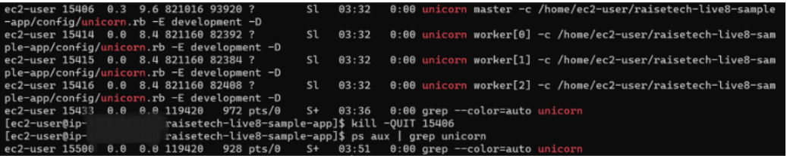

# UnicornとNginxを利用するときによく使うコマンド
・Unicornを起動(development)　```bundle exec unicorn -c /home/ec2-user/[プロジェクトディレクトリ名]/config/unicorn.rb -E development -D```

・Unicornを停止(マスタープロセスのPIDが以下の場合は15406)　```kill -9 [マスタープロセスのPID]```



・Unicornが起動しているかの確認(上記のような`master`や`worker`が表示されない場合はUnicornサーバーが停止している)　```ps aux | grep unicorn```

・単一のファイルを削除　```rm [ファイル名]```

・ファイルの中身を表示　```cat [ファイル名]```

・Nginxの起動　```sudo systemctl start nginx```

・Nginxが起動しているかの確認　```sudo systemctl status nginx```

・Nginxの停止　```sudo systemctl stop nginx```

・Nginxのエラーログやアクセスログのファイルがあるか確認　```sudo ls /var/log/nginx/```

・Nginxのerror.logまたはaccess.logの中身を見る　```sudo cat /var/log/nginx/error.log```

・Nginxのerror.logまたはaccess.logの削除　```sudo rm /var/log/nginx/error.log```

・Nginxのerror.logまたはaccess.logの作成　```sudo touch /var/log/nginx/error.log```

・後半の20行だけログを表示　```sudo tail -n 20 [ファイル名]```

・gemファイルの変更を反映　```bundle install```

・特定のファイルやディレクトリを検索する　`find / -name "[ファイル名またはディレクトリ名]"`

・ブラウザからEC2上のアプリにアクセスするにはEC2のパブリックIPv4 アドレスをブラウザに入力

・ブラウザからALBを経由してEC2上のアプリにアクセスするにはALBのDNS名をブラウザに入力

# EC2上のNginxとUnicornにアプリをデプロイしてALB経由でS3に画像をアップロード
※インストールするパッケージのバージョンはREADMEに書かれている

【手動構築の手順(IAMロール)】
1. VPCの作成手順は通常通り。
2. EC2のセキュリティグループはインバウンドルールにポート番号8080のTCPの0.0.0.0/0とポート番号22のTCPのマイIPからの通信のみを許可する。S3FullAccessのポリシーをアタッチしたIAMロールをEC2に割り当てる。
3. RDSのセキュリティグループはインバウンドルールにタイプ`MYSQL/Aurora`のTCPのポート番号3306のソースはEC2からの通信のみを許可する。
4. マネジメントコンソールのEC2の画面から左のサイドバーにある「ロードバランサー」→「ロードバランサーの作成」をクリックして ALBを選択する。
5. 「基本的な設定」の項目では、「ロードバランサー名」に名前をつける。
6. 「ネットワークマッピング」の項目では、「VPC」にEC2があるVPCを選択、AZを二つ選択し、サブネットは⚠️のマークが表示されないサブネットを選択する。
7. 「セキュリティグループ」の項目では、タイプHTTPのTCPのポート番号80の0.0.0.0/0を許可する。
8. 「リスナーとルーティング」の項目では、「デフォルトアクション」の「ターゲットグループの作成」をクリックする。
9. 「基本的な設定」の項目では、「ターゲットグループ名」に名前をつけて、EC2が設置されているVPCを選択。
10. 一番下までスクロールして「次へ」をクリックする。
11. 「使用可能なインスタンス」の項目で対象のEC2にチェックをつけ、「選択したインスタンスのポート」で8080を入力し、「保留中として以下を含める」をクリックする。
12.  一番下までスクロールして「ターゲットグループの作成」をクリックする。
13.  ALBを作成しているページに戻って「デフォルトアクション」にさっき作成したターゲットグループを選択する。
14.  一番下までスクロールして「ロードバランサーの作成」をクリックする。
15. マネジメントコンソールのS3の画面から「バケットを作成」をクリックする。
16. 「一般的な設定」の項目では、「バケット名」で名前をつけて、「AWS リージョン」でEC2が配置されているリージョンを選択する。EC2が配置されているリージョンはEC2のAZがus-east-1aとなっていた場合、us-east-1がリージョン名になる。
17. 一番下までスクロールして「バケットを作成」をクリックする。
18. 作成したS3バケットの詳細ページに行き、「アクセス許可」をクリックする。下にスクロールするとCORSを編集できる項目があるので以下のコードを追加する。
```
[
    {
        "AllowedHeaders": [
            "*"
        ],
        "AllowedMethods": [
            "GET",
            "PUT",
            "POST",
            "DELETE",
            "HEAD"
        ],
        "AllowedOrigins": [
            "*"
        ],
        "ExposeHeaders": [],
        "MaxAgeSeconds": 3000
    }
]
```

19. `sudo yum install git -y`
20. `git clone [リポジトリのURL]`
21. `sudo yum update -y`
22. `sudo yum install -y curl gpg gcc gcc-c++ make`
23. `curl -sSL https://rvm.io/mpapis.asc | gpg2 --import -`
24. `curl -sSL https://rvm.io/pkuczynski.asc | gpg2 --import -`
25. `gpg2 --keyserver hkp://keyserver.ubuntu.com --recv-keys 409B6B1796C275462A1703113804BB82D39DC0E3 7D2BAF1CF37B13E2069D6956105BD0E739499BDB`
26. `curl -sSL https://get.rvm.io | bash -s stable`
27. `echo 'source ~/.rvm/scripts/rvm' >> ~/.bashrc`
28. `source ~/.rvm/scripts/rvm && rvm list | grep 'ruby-[rubyのバージョン]'`
29. `source ~/.rvm/scripts/rvm && rvm install ruby-[rubyのバージョン]`
30. `source ~/.rvm/scripts/rvm && gem install bundler -v [bundlerのバージョン]`
31. `sudo yum install mysql-devel -y`
32. `cd [プロジェクトディレクトリ名]`
33. `bundle install`
34. `sudo yum install python3-pip -y`
35. `sudo pip3 install PyMySQL`
36. `sudo yum install mysql -y`
37. `mysql -h [RDSのエンドポイント] -u [RDSのマスターユーザー名(デフォルトはadmin)] -p[RDSのマスターパスワード] -e "CREATE DATABASE IF NOT EXISTS [任意のデータベーステーブル名];"`
38. `cd config`
39. `cp database.yml.sample database.yml`
40. `vi database.yml`
41. `username`の値をRDSのマスターユーザー名(デフォルトはadmin)に変更。
42. `default`の`password`にRDSのマスターパスワードを追加。
43. `development`と`test`の`database`の値を37で作成したデータベーステーブル名に変更。
44. `host`キーと値であるRDSのエンドポイントを`development`と`test`に追加。
45. `port`キーと値であるRDSのポート番号(デフォルトは3306)を`development`と`test`に追加。
46. `development`と`test`の`socket`をコメントアウトにする。データの保存先がRDSなので`socket`をコメントアウトにしている。
47. ファイルを保存する
48. `cd ..`
49. `curl -o- https://raw.githubusercontent.com/nvm-sh/nvm/v[nvmのバージョン]/install.sh | bash`
50. `cd`
51. `echo 'export NVM_DIR="$HOME/.nvm"' >> /home/ec2-user/.bashrc`
52. `cd [プロジェクトディレクトリ名]`
53. `[ -s "$NVM_DIR/nvm.sh" ] && \. "$NVM_DIR/nvm.sh"`
54. `. ~/.nvm/nvm.sh`
55. `nvm install [Node.jsのバージョン]`
56. `cd`
57. `export PATH="/home/ec2-user/.nvm/versions/node/v[Node.jsのバージョン]/bin:$PATH"`
58. `npm install -g yarn`
59. `sudo yum install -y ImageMagick`
60. `cd [プロジェクトディレクトリ名]`
61. `sudo amazon-linux-extras install nginx1 -y`
62. `rvmsudo -u ec2-user bundle install`
63. `cd config`
64. `vi unicorn.rb`
65. `worker_processes`の次の行に追加　`working_directory "/home/ec2-user/[プロジェクトディレクトリ名]"`。この設定をすることでUnicornがアプリケーションを実行するディレクトリを認識できるようになる。
66. `listen`の最後に追加　`, :backlog => 64`。`:backlog => 64`とすることで64個の接続リクエストを待機させることができる。
67. `listen`の次の行に追加　`listen 8080, :tcp_nopush => true`。`listen 8080`はUnicornがポート番号8080でHTTP通信を許可することを設定していて、`:tcp_nopush => true`はTCPの性能を最適化するための設定。
68. `pid`の次の行に追加　`stdout_path "/home/ec2-user/[プロジェクトディレクトリ名]/unicorn.log"`。これによってUnicornのログが出力されるファイルを固定化することができる。
69. `stdout_path`の次の行に追加　`stderr_path "/home/ec2-user/[プロジェクトディレクトリ名]/unicorn.log"`。これによってUnicornのエラーのログが出力されるファイルを固定化することができる。
70. ファイルを保存する。
71. `sudo vi /etc/nginx/nginx.conf`
72. `user nginx;`を`user ec2-user;`に変更。こうすることで`unicorn.sock`の実行権限が`ec2-user`になっていてもNginxはUniconとやり取りできるようになる。
73. 以下をhttpブロックに追加。このブロックを追加することでUnicornにリクエストを送信できるようになる。

```
upstream app {
        server unix:/home/ec2-user/[プロジェクトディレクトリ名]/unicorn.sock;
    }
```


74. serverブロックに以下を追加。

```
        location / {
            proxy_set_header X-Forwarded-For $proxy_add_x_forwarded_for;
            proxy_set_header Host $http_host;
            proxy_redirect off;
            proxy_pass http://app;
        }

        location ^~ /assets/ {
            root /home/ec2-user/[プロジェクトディレクトリ名]/public;
            gzip_static on;
            expires max;
            add_header Cache-Control public;
        }
```


75. ファイルを保存する。
76. `vi environments/development.rb`
77. `config.active_storage.service = :local`を`config.active_storage.service = :amazon`に書き換える。
78. `config.assets.debug = true`を以下に書き換える。

```
  config.assets.debug = false
  config.assets.compile = true
```

79. ファイルを保存する。
80. `cd ..`
81. `RAILS_ENV=development bundle exec rake assets:precompile`
82. `sudo su - ec2-user -c 'bin/rails db:migrate RAILS_ENV=development'`
83. `cd`
84. `sudo su - ec2-user -c 'cd /home/ec2-user/[プロジェクトディレクトリ名] && bin/rails db:migrate RAILS_ENV=development'`
85. `cd /home/ec2-user/[プロジェクトディレクトリ名]/config/storage.yml`
86. `region`を対象のS3バケットがあるリージョン、`bucket`を対象のS3バケット名に変更する。
87. NginxとUnicornを起動すると`Blocked host`が表示される。
88. `vi config/environments/development.rb`
89. ファイルの末尾に`Blocked host`で表示された`config.hosts << "ALBのDNS名"`を記載する。
90. NginxとUnicornを停止して起動する。

【手動構築の手順(アクセスキー)】

`storage.yml`の`access_key_id`と`secret_access_key`をS3へのアクセスを許可したIAMユーザーのアクセスキーとシークレットアクセスキーに変更する。今回はアクセスキーを使うので手順2で割り当てたIAMロールを取り外す。

# S3にオブジェクトが保存されているかEC2上から確認
1. AWS CLIの設定　```aws configure```
2. 以下の情報を入力します
```
AWS Access Key ID: IAMユーザーのアクセスキーID
AWS Secret Access Key: IAMユーザーのシークレットアクセスキー
Default region name: S3バケットのリージョン名（例：ap-northeast-1）
Default output format: json
```
3. S3バケット内のオブジェクトの確認　aws s3 ls s3://S3バケット名/

# S3のCORSについて
## CORSとは
S3バケットに対してWebサイトやWebアプリケーションからアクセスを許可するかのルールを設定する項目
## CORSのコード解説
```
[
    {
        "AllowedHeaders": [
            "*"
        ],
        "AllowedMethods": [
            "GET",
            "PUT",
            "POST",
            "DELETE",
            "HEAD"
        ],
        "AllowedOrigins": [
            "*"
        ],
        "ExposeHeaders": [],
        "MaxAgeSeconds": 3000
    }
]
```
### AllowedHeaders
リクエストが持っているどの情報に対して許可するかを設定する。
### *(アスタリスク)
すべてを許可することを意味する。
### AllowedMethods
リクエストのどの行動を許可するかを設定する。
### PUT
更新
### POST
作成
### HEAD
ヘッダーの情報
### AllowedOrigins
どのWebサイトやWebアプリケーションからのアクセスを許可するかを設定する。
### ExposeHeaders
ブラウザから見ることができるヘッダーの情報を指定する。
### []
[]の中に何もない場合は何も設定や指定をしていないことを意味する。
### MaxAgeSeconds
ブラウザがS3から提供してもらった情報を覚えていられる時間を設定する。設定した時間が過ぎたらブラウザは再度S3に対してデータを共有しても良いのかをS3に尋ねる必要がある。
### 3000
3000秒のこと。
# RDSのセキュリティグループを変更
AWSのマネジメントコンソールからセキュリティグループを変更したいRDSの詳細情報が書かれているページに行き、右上の「変更」をクリックしてそこに書かれているセキュリティグループを変更する。
